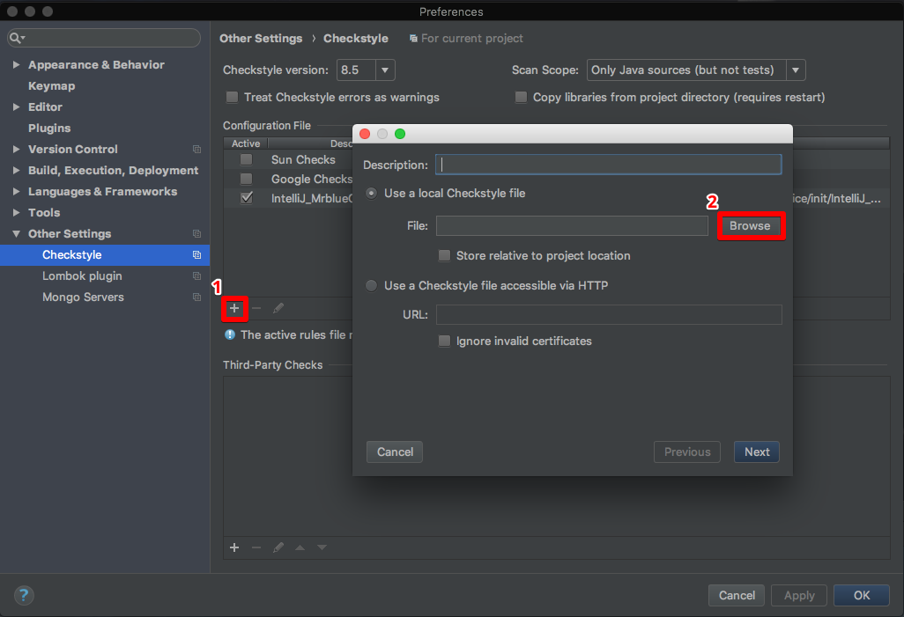

이직한 회사에서 새로운 프로젝트를 맡아서 개발은 진행하고 있다. 이직한 회사의 현재 상황은 .Net기반의 시스템을 Java/Spring 기반으로 넘어가는 단계이기 때문에 아직까지 코드 관리를 할 수 있는 체계가 전혀 잡혀 있지 않았다. 따라서 코드관리에 대해 알아보다가 StyleCheck 라는 인텔리J 플러그인을 알게 되었다.

### 1. CheckStyle

CheckStyle이란 프로그래머가 코딩 표준을 준수하는 Java 코드를 작성하도록 돕는 개발 도구이다.  물론 CheckStyle을 사용하더라도 완벽한 코딩 표준을 준수할 수는 없지만, 일차적으로 필터링을 할 수 있기 때문에 개발자로 하여금 반복적이고 지루할 수도 있는 작업을 자동화 할 수 있다.(사실 위에 언급한 코딩  표준 자체도 정확한 규칙이 있는것도 아니다.)

CheckStyle은 기본적으로 Sun, Google의 코드 스타일 중에 한가지를 선택하여 사용할 수 있는데, Sun 코드 스타일의 경우 최근 commit 이력이 없고, Google 코드 스타일의 경우 최근에도 지속적으로 관리가 되고 있으며, Java8의 람다식까지 검사할 수 있기 때문에 Google코드 스타일을 Custom하여 사용하기로 하였다.

#### 1.1. 설치

Mac OS:

1. `Intellij IDEA` > `Preferences` > `Plugins` > `Broswe repositories...` 
2. CheckStyle-IDEA 검색 및 인스톨

#### 1.2. 설정

Mac OS:

1. `Intellij IDEA` > `Preferences` > `Other Settings` > `Checkstyle`

2. `+` > `Broswe`

   

3. 경로선택: init/IntelliJ_MrblueCheckStyle.xml 선택

#### 1.3. 사용법

1. Checksytle 플러그인  탭
2. 코딩 스타일 리스트
3. 코드 검사
4. 코드 스타일 위반 내역

### 2. Code Style

앞에서 Checkstyle이 대한 개념과 설정 및 사용방법에 대해 알아보았다. 추가적으로 Checkstyle 플러그인과 함께 설정해야 할 것이 있는데, 바로 Code Style 이다. Code Style는 IDEA에서 코드 제너레이터를 통해 생성되는 코드 스타일을 정의해 주는 설정이다. 앞서 정의한 코드 표준과 코드 제너레이터에서 생성시켜 주는 코드 스타일이 다르다면, 프로그래머들이 불필요하게 코드표준과 제너레이터로 생성된 코드 스타일을 일일히 수정을 해야하는 반복적이고 불필요한 작업을 줄일 수 있도록 ChechStyle과 Code Style의 코드 표준을 동기화 하도록 한다.

#### 2.1. 설정

mac OS:

1. `Intellij IDEA` > `Preferences` > `Editor` > `Code Style` > `Java`

2. `Scheme: 톱니바퀴` 누름

   

3. `import Scheme` > `Intellij IDEA  code style XML`

4. 경로 선택: init/IntelliJ_MrblueStyle.xml 선택

   ​