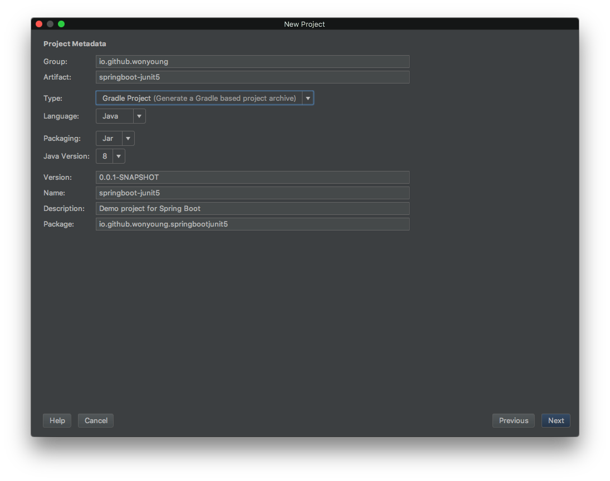
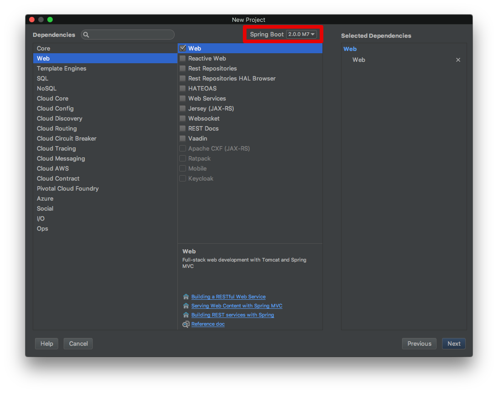

### 1. 소개

해당 글은 스프링부트 애플리케이션으로 JUnit5를 실행하는 튜토리얼입니다.


### 2. 절차

#### 2.1. 프로젝트 생성

- `Gradle project`로 프로젝트를 생성합니다.



- 스프링 버전은 `2.0.0.M7`을 선택해 주고, web 모듈을 선택해 줍니다.



### 3. Gradle 의존성

해당 예제에서는 JUnit4를 필요하지 않으므로 JUnit을 제외시킵니다.

```java
testCompile('org.springframework.boot:spring-boot-starter-test') {
	exclude group: 'junit', module: 'junit'
}
```

다음으로 JUnit5 의존성을 추가시킵니다.

```java
testCompile('org.junit.platform:junit-platform-engine:1.0.3')
testCompile('org.junit.platform:junit-platform-launcher:1.0.3')
testCompile('org.junit.jupiter:junit-jupiter-engine:5.0.3')
testCompile('org.junit.jupiter:junit-jupiter-api:5.0.3')
```


### 4. 예제 코드

```java
@ExtendWith(SpringExtension.class)
@SpringBootTest(webEnvironment = SpringBootTest.WebEnvironment.RANDOM_PORT)
public class SpringbootJunit5ApplicationTests {

	@Test
	public void contextLoads() {
        System.out.println("테스트");
	}
}
```


### 5. 라이프 사이클

```java
@DisplayName("라이프사이클 테스트")
public class LifeCycleTest {

    @BeforeAll
    public static void initAll() {
        System.out.println("initAll");
    }

    @BeforeEach
    public void init() {
        System.out.println("init");
    }

    @DisplayName("호잇호잇")
    @Test
    public void someTest() {
        System.out.println("someTest");
    }

    @Disabled
    @Test
    public void anyTest() {
        System.out.println("anyTest");
    }

    @AfterEach
    public void tearDown() {
        System.out.println("tearDown");
    }

    @AfterAll
    public static void tearDownAll() {
        System.out.println("tearDownAll");
    }
}
```


### 6. 결론

해당 튜토리얼을 통해 *Spring boot* 애플리케이션에서 JUnit5을 실행시키는 방법에 대해 알아보았습니다. 예제 소소 코드는 [제  GitHub](https://github.com/WonYoungPark/springboot-junit5) 프로젝트에서 찾을 수 있습니다.


### 7. Reference

- https://howtoprogram.xyz/2017/09/12/junit-5-spring-boot-example/
- http://junit.org/junit5/docs/current/user-guide/

