## 1. 소개

IntelliJ IDEA는 JetBrains사에서 제작한 상용 자바 통합 개발 환경입니다. 인텔리제이를 설명하기 앞서 IDE가 무엇인지 부터 간단하게 설명하겠습니다. [위키백과](https://ko.wikipedia.org/wiki/%ED%86%B5%ED%95%A9_%EA%B0%9C%EB%B0%9C_%ED%99%98%EA%B2%BD)에 따르면 **"통합 개발 환경(Integrated Development Environment, IDE)은 코딩, 디버그, 컴파일, 배포 등 프로그램 개발에 관련된 모든 작업을 하나의 프로그램 안에서 처리하는 환경을 제공하는 소프트웨어이다."** 라고 합니다. IDE를 사용함으로서 개발자들은 개발 생산성 및 편리성이 좋아지고 최근에 이르러서는 중복코드 알림같은 다양한 기능으로 클린코드를 작성할 수 있도록 도와줍니다.

인텔리의 경우 무료버전과 유료버전 두가지가 존재합니다. 무료버전보다 유료버전이 더 좋겠지만, 무료버전도 충분히 훌륭한 IDE이기 때문에 아래의 버전별 제공 기능을 확인하시고 구매하시면 될거 같습니다. 필자의 경우는 Spring을 많이 사용하기 때문에 유료버전을 구매하여 사용하고 있습니다.

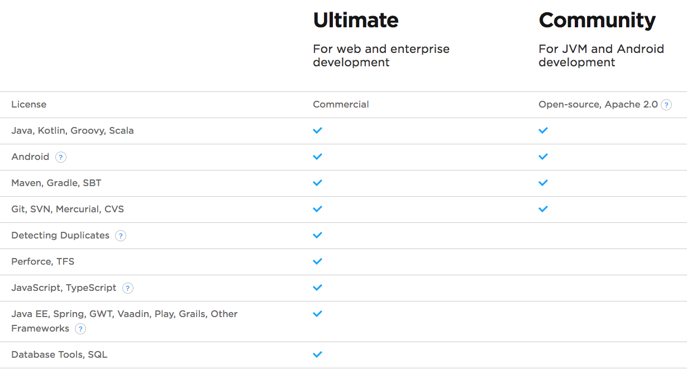

IDE의 다양한 장점들이 있지만 개발 생산성에 포커스를 맞춰서 좋은 기능들이나 단축키 등을 공유드리겠습니다.

## 2. 팁

인텔리제이의 경우 많은 기능들이 존재되고 있고, 지속적으로 개발자 생산성과 편리성을 위해 개발되어지고 있습니다. 인텔리제이의 경우 eclipse에 비해 상대적으로 대중화되어 있지 않기 때문에 정보가 많이 없지만 [인텔리j 활용꿀팀 42가지](http://www.kwangsiklee.com/ko/2016/12/%EC%9D%B8%ED%85%94%EB%A6%ACj-%ED%99%9C%EC%9A%A9%EA%BF%80%ED%8C%81-42%EA%B0%80%EC%A7%80/) 라는 블로그에 가시면 좋은 내용들이 많이 있습니다. ***특히 최대한 마우스 사용 없이 키보드만으로 IDE를 사용하는 것을 지향하라.*** 라는 내용이 제일 와닿았습니다. **꼭 보시길 권장드립니다.** 

이미 위의 블로그를 통해서 많은 정보들이 작성되어져 있기 때문에, 필자가 생각하는 중요부분과 추가적인 내용을 정리해 보도록 하겠습니다.

### 2.1. 탭을 사용하지 말라

**탭을 사용하면 마우스를 적극적으로 사용해야 하므로 집중이 흐트려질 수 있습니다.** 필자의 말에 동의를 하지 못하시는 분들도 있을 것이라고 생각합니다. 저 또한 그랬으니깐요. 하지만 탭을 사용 않다 보니 실제로 코드에 더 집중할 수는 효과를 경험하고 있습니다. 또한 인텔리제이는 탭을 사용하지 않더라도 편리하고 자연스럽게 사용할 수 있도록 충분한 기능들을 지원해 줍니다.

#### 2.1.1. 설정

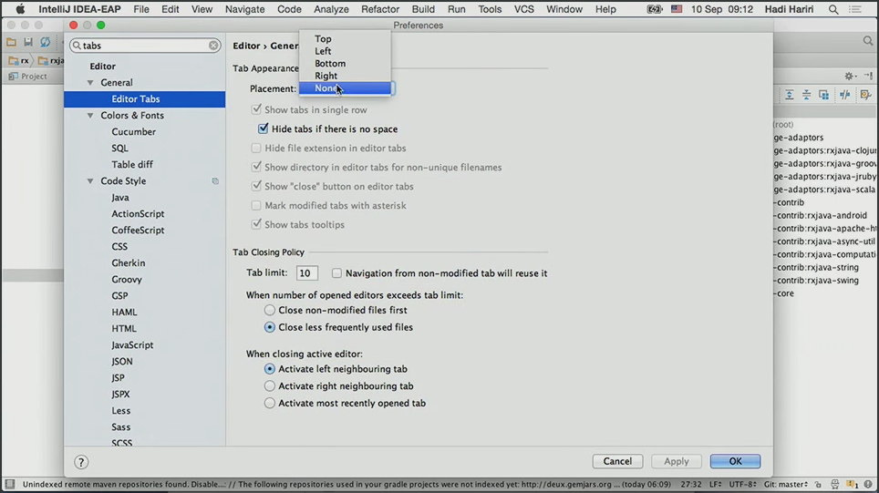

#### 2.1.1. 대안1 : 파일검색 기능 활용

- `command` + `o` : class 검색
- `command` + `shift` + `o` : 파일 검색

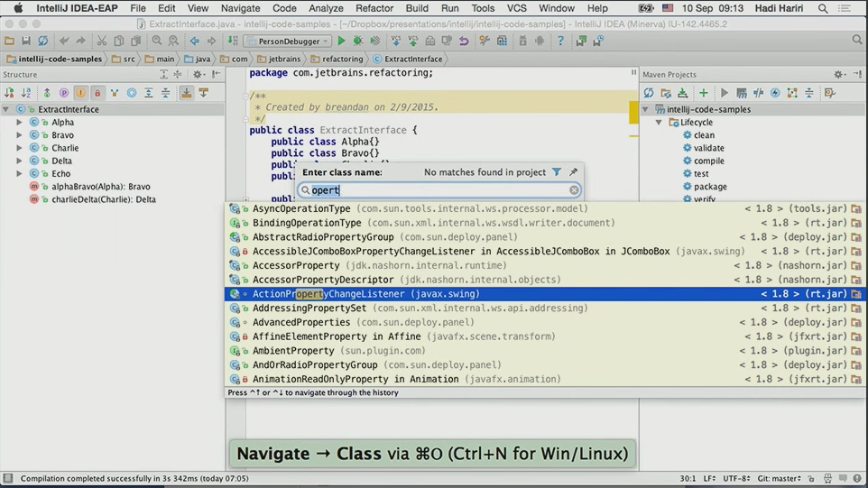

#### 2.1.2. 대안2 : 최근 사용파일 기능 활용

`command` + `e`

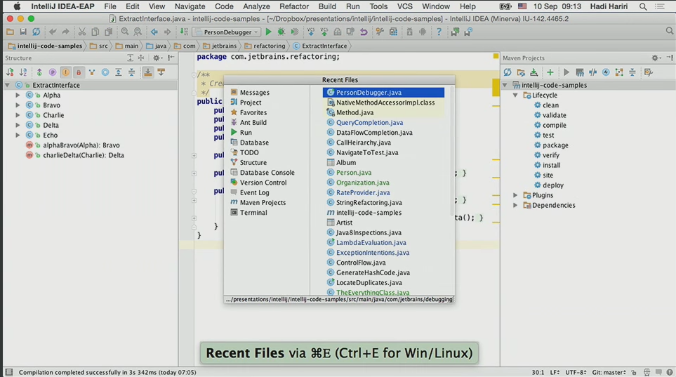

### 2.2. 에디터/창 Focus

- `command` + `0~9 ` 를 처음 누르면 창이 선택되고 두번 째 누르면 포커스가 이동합니다.
- 창이 포커스된 상태에서 `Esc` 를 누르면 **무조건** 에디터 창으로 포커스가 이동됩니다.

#### 2.2.1. 창 모두 숨기기/보이기

`command` + `shift` + `F12 ` 를 동시에 누르면 창이 모두 숨겨지거나 보여집니다.

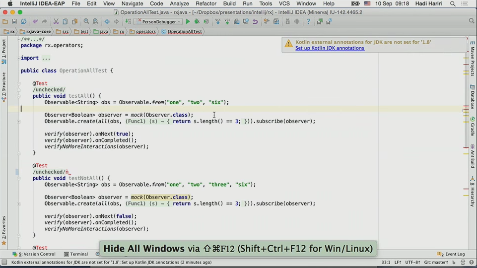

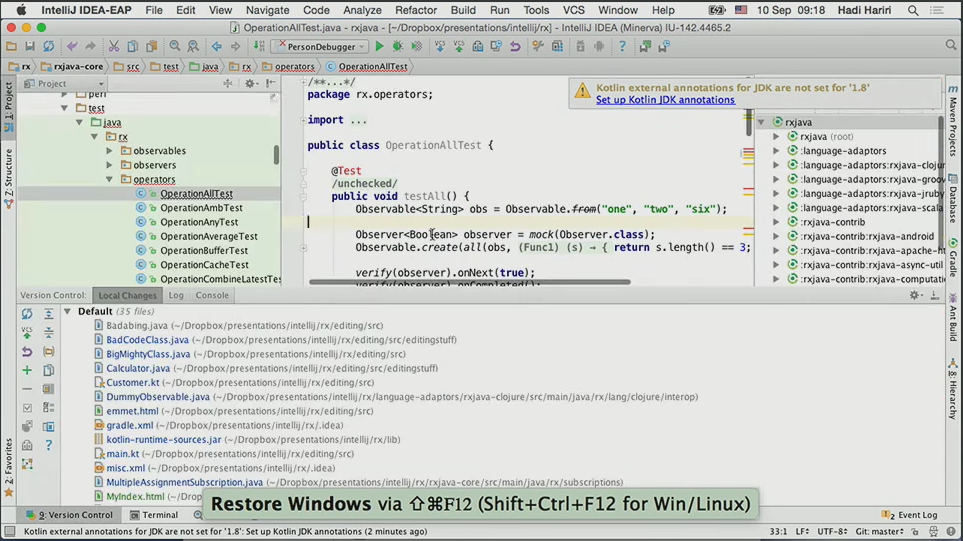

### 2.3. 파리미터 정보

`command`+ `p` 를 눌러서 메소드의 파라미터나 어노테이션의 파라미터 정보를 빠르게 툴팁으로 확인할 수 있습니다.

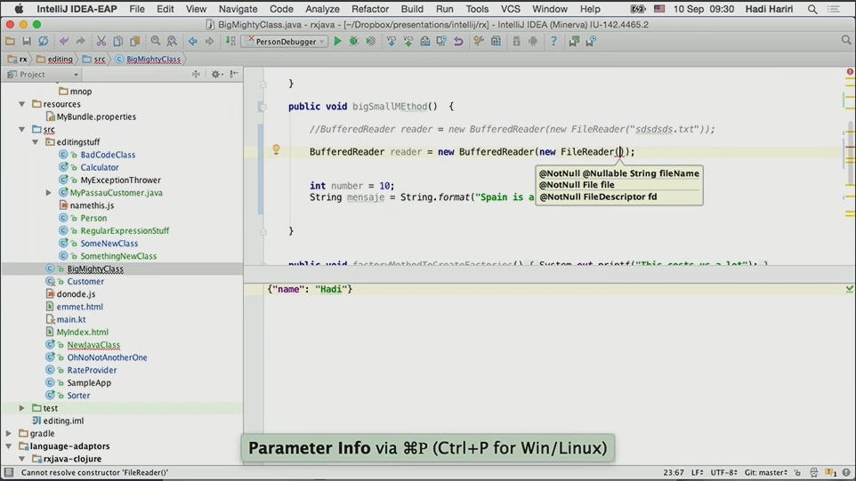

### 2.4. 클래스 구조 / filestructure

클래스 구조를 보거나 메소드를 찾을때 유용하게 사용할 수 있습니다. 필자의 경우 컴파일시에 소스코드를 생성해 주는 라이브러리인 lombok을 사용하기 때문에 자주 사용하고 있습니다.

#### 2.4.1. 클래스 구조

`command` + `7 ` 를 누르면 클래스 구조 창이 표시됩니다.

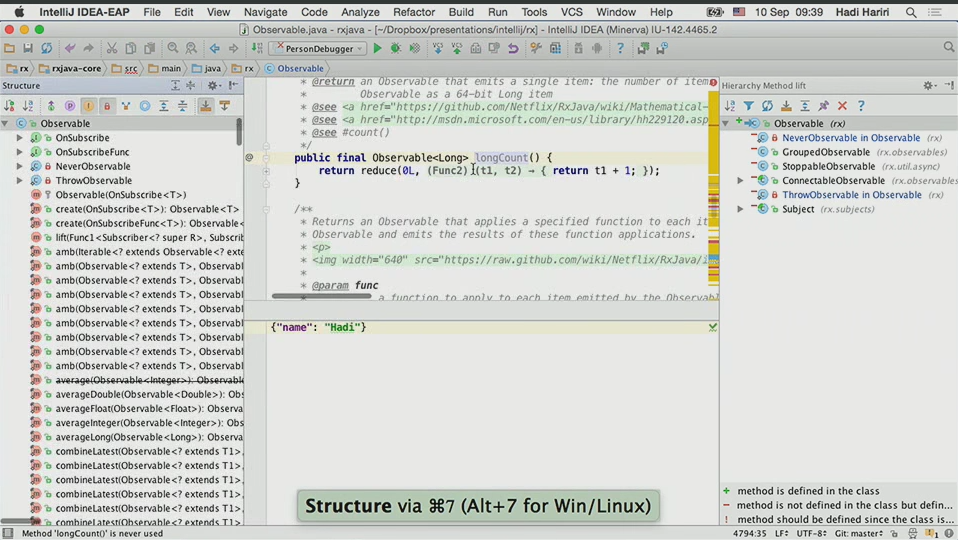

#### 2.4.2. filestructure

`command` + `F12` 를 누르면 filestructure가 표시됩니다.

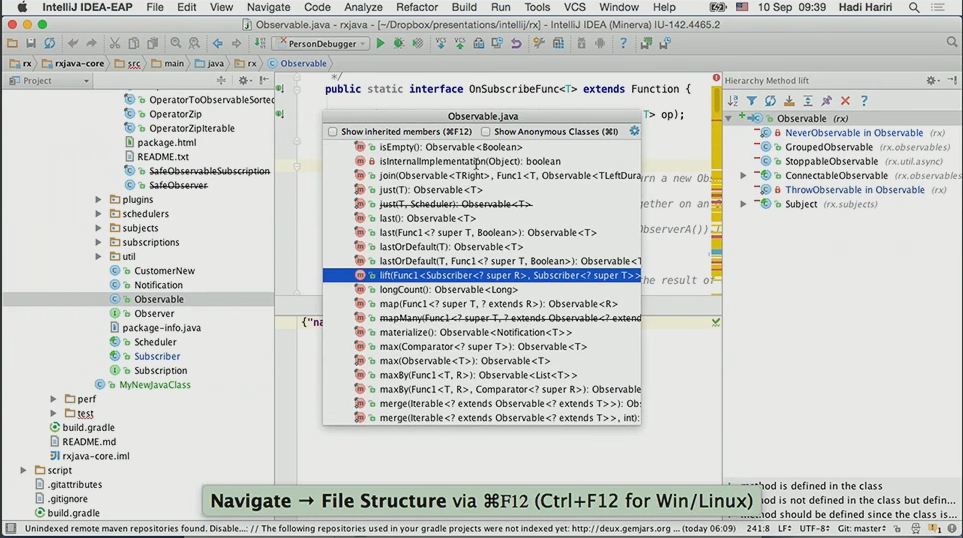

### 2.5. 붙여넣기

개발을 하다보면 `Ctrl` + `c, v` 를 할 때가 빈번하게 발생하게 되는데요. 인텔리제이에서는 일반적인 `Ctrl` + `c, v` 도 지원하지만 다수의 복사 항목을 클립보드에 저장하였다가 사용할 수 있는 기능을 지원합니다.

`command` + `shift` + ` v`

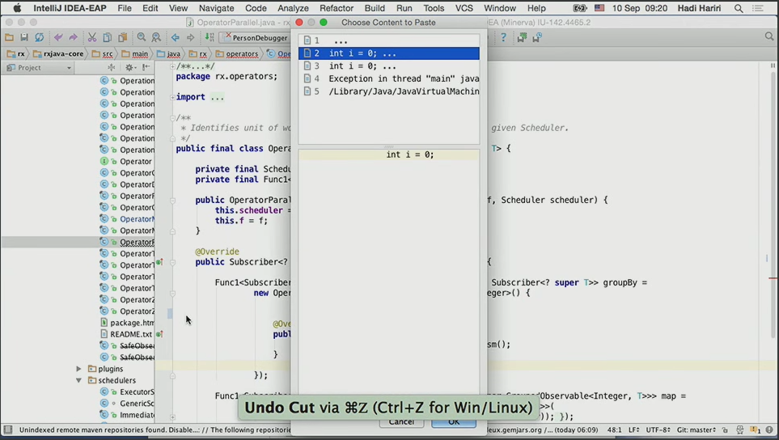

### 2.6. Generate

`command` + `N`

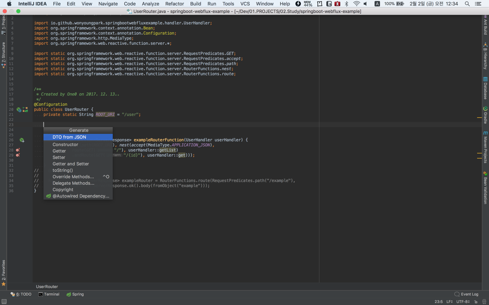

## 3. 단축키

### 3.1. Edit

|         기능          |              단축키              | 비고   |
| :-----------------: | :---------------------------: | :--- |
|     열 선택 모드 전환      |     `command + shift + 8`     |      |
|      선택 확장, 축소      |        `option +↑, ↓`         |      |
|        줄 복사         |         `command + d`         |      |
|    마지막 수정 장소 이동     | `command + shift + backspace` |      |
|        제너레이트        |        `command` + `N`        |      |
| `Serround` + `with` |  `command`  + optoin` + 'T'   |      |
|                     |                               |      |
|                     |                               |      |
|                     |                               |      |

